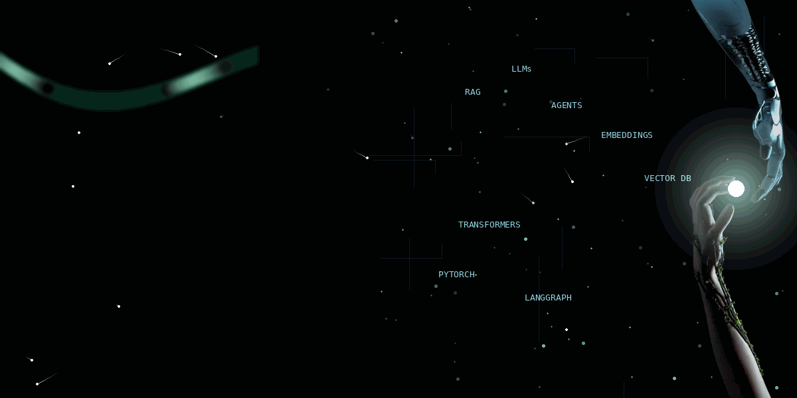
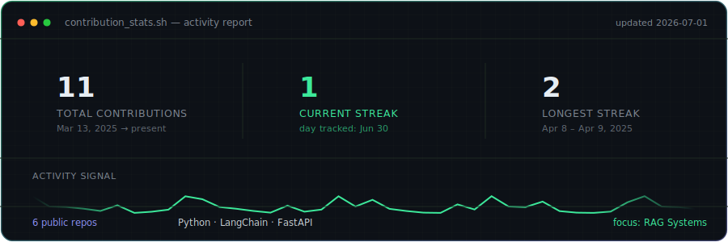

<div align="center">

<!-- ██████╗  █████╗ ███╗   ██╗███╗   ██╗███████╗██████╗      -->
<!--  ANIMATED BANNER — replace path with your repo's GIF URL  -->



</div>

---

<div align="center">

<!-- ⌨️  TYPING SVG — cycles through roles -->
[](https://git.io/typing-svg)

</div>

<br/>

<!-- ═══════════════════════════  ABOUT ME  ═══════════════════════════ -->

<!-- ═══════════════════════════  ABOUT ME  ═══════════════════════════ -->


<br/>

<table width="100%" border="0">
<tr>
<td width="55%" valign="top">

### 👩‍💻 &nbsp;About Me


```python
class FatimaZahraMoumene:

    name       = "Fatima Zahra Moumene"
    role       = "AI Engineer"
    location   = "Morocco 🇲🇦"
    education  = "M.Sc. Data Science & Intelligent Systems"

    specialties = {
        "🔗 LLM":    ["Prompt Engineering", "Fine-tuning", "Evaluation"],
        "📚 RAG":    ["Vector DBs", "Hybrid Search", "Re-ranking"],
        "🤖 Agents": ["LangGraph", "Tool Use", "Memory"],
        "📊 Data":   ["EDA", "Feature Eng.", "ML Pipelines"],
    }

    currently  = "Building intelligence that creates impact 🚀"
    open_to    = ["Research", "Collaboration", "Open Source"]

    def say_hi(self):
        print("Thanks for dropping by!")
        print("Let's build something amazing. 🌟")
```

</td>
<td width="45%" valign="top" align="center">

<br/><br/>


<br/><br/>


</td>
</tr>
</table>


<br/>


<!-- ═══════════════════════════  SKILLS  ═══════════════════════════ -->

## 🧠 &nbsp;Tech Arsenal

<div align="center">

### 🤖 &nbsp;AI / ML Core


### 🔗 &nbsp;LLMs · RAG · Agents


### 🛠️ &nbsp;Data & Backend


### ☁️ &nbsp;Cloud · DevOps · Tools


</div>

---

<!-- ═══════════════════════════  WHAT I BUILD  ═══════════════════════════ -->

## 🚀 &nbsp;What I Build

<table>
<tr>
<td width="50%" valign="top">

### 🔮 &nbsp;LLM Applications
> End-to-end intelligent apps powered by large language models — from prompt engineering to production deployment with evaluation pipelines.

</td>
<td width="50%" valign="top">

### 📚 &nbsp;RAG Systems
> Retrieval-Augmented Generation pipelines that ground LLMs in real knowledge, using vector stores, hybrid search & re-ranking.

</td>
</tr>
<tr>
<td width="50%" valign="top">

### 🤖 &nbsp;AI Agents
> Autonomous agents with tool use, memory and planning — built with LangGraph for reliable, stateful multi-step reasoning.

</td>
<td width="50%" valign="top">

### 📊 &nbsp;Data Science
> From raw data to insight: EDA, feature engineering, statistical modelling, and ML pipelines that actually work in production.

</td>
</tr>
</table>

---

<!-- ═══════════════════════════  GITHUB STATS  ═══════════════════════════ -->

## 📊 &nbsp;GitHub Stats

<div align="center">



</div>

<!--
  This card is self-hosted, not fetched from a third-party service — it
  never breaks if that service goes down, and you fully control what it says.

  TO UPDATE IT (do this whenever you land a contribution):
    1. Open  stats_config.json  and edit the numbers.
    2. Run   python3 generate_stats_card.py
    3. Commit the refreshed  contribution_stats.svg  + the edited config.

  Files: stats_config.json · generate_stats_card.py · contribution_stats.svg
-->


---

<!-- ═══════════════════════════  FEATURED PROJECTS  ═══════════════════════════ -->

<!-- ═══════════════════════════  AI PHILOSOPHY  ═══════════════════════════ -->

## 💡 &nbsp;My AI Philosophy

<div align="center">


</div>

<!--
  Five quotes crossfade automatically, one at a time, ~5s each — the
  guiding-principle lines that used to live in a separate 3-column table
  are now part of the same rotation, so there's one clean animated card
  instead of a banner + table + quote block.

  Same SMIL-animation / jsDelivr-CDN situation as neural_defender.svg
  above: GitHub's README renderer strips SMIL tags from locally-embedded
  SVGs, so this has to be loaded from a CDN mirror to actually animate.

  TO EDIT THE QUOTES:
    1. Open quotes_config.json and edit/add/reorder entries.
    2. Run   python3 generate_philosophy_card.py
    3. Commit the refreshed philosophy_quotes.svg + the edited config.
    4. Visit this once to force the CDN to pick up the change immediately
       (otherwise it can take up to ~7 days to refresh on its own):
       https://purge.jsdelivr.net/gh/zahra-mmn/zahra-mmn@main/philosophy_quotes.svg

  Files: quotes_config.json · generate_philosophy_card.py · philosophy_quotes.svg
-->


---

<!-- ═══════════════════════════  CURRENT FOCUS  ═══════════════════════════ -->

## 🎯 &nbsp;Currently

<table>
<tr>
<td>🔭 &nbsp;<b>Building</b></td>
<td>Production-ready RAG systems with advanced retrieval strategies</td>
</tr>
<tr>
<td>🌱 &nbsp;<b>Learning</b></td>
<td>Multi-agent orchestration · AI safety · Fine-tuning strategies</td>
</tr>
<tr>
<td>🤝 &nbsp;<b>Open to</b></td>
<td>Collaborations on LLM projects, research, and open-source AI tools</td>
</tr>
<tr>
<td>💬 &nbsp;<b>Ask me about</b></td>
<td>RAG architectures, LangChain/LangGraph, vector databases, LLM evaluation</td>
</tr>
<tr>
<td>⚡ &nbsp;<b>Fun fact</b></td>
<td>I believe the best AI systems are the ones that feel <i>invisible</i> — they just work</td>
</tr>
</table>

---

<!-- ═══════════════════════════  ACTIVITY  ═══════════════════════════ -->

## 📈 &nbsp;Activity Graph

<div align="center">

[](https://github.com/ashutosh00710/github-readme-activity-graph)

</div>

---

<!-- ═══════════════════════════  PROFILE TROPHY  ═══════════════════════════ -->

## 🏆 &nbsp;GitHub Trophies

<div align="center">

<a href="https://github.com/ryo-ma/github-profile-trophy">
  
</a>

</div>


---

<!-- ═══════════════════════════  CONNECT  ═══════════════════════════ -->

## 🌐 &nbsp;Let's Connect

<div align="center">

[](https://linkedin.com/in/fatima-zahra-moumene)
[](mailto:your.email@gmail.com)
[](https://github.com/zahra-mmn)
[](https://kaggle.com/zahra-mmn)
[](https://your-portfolio.dev)

</div>

---

<!-- ═══════════════════════════  GAME  ═══════════════════════════ -->

## 🧠 &nbsp;Neural Defender — Guard the Model

<div align="center">


> *Plays itself on a loop — no click, no hosting, no JS. Threats are noise injection,*
> *overfitting, bias drift & adversarial attacks · live accuracy readout · themed around the ML workflow*

</div>

<!--
  WHY THIS SVG IS LOADED FROM cdn.jsdelivr.net INSTEAD OF A LOCAL PATH:

  neural_defender.svg animates using SMIL (<animate>, <animateTransform>,
  <animateMotion>) — plain markup, not JavaScript. But GitHub's own README
  renderer sanitizes locally-embedded SVGs and strips those animation tags
  (the same policy that blocks <script>), so a relative path like
  src="neural_defender.svg" only ever shows a static first frame in the
  README — even though the file itself is fully animated (that's why it
  plays correctly if you open the raw file directly).

  Pointing at a jsDelivr mirror of the same file sidesteps GitHub's
  sanitizer entirely: the browser fetches the SVG straight from jsDelivr's
  CDN, untouched, so the animation plays. This is the same reason the
  Typing SVG and streak-stats images elsewhere in this README are loaded
  from external URLs rather than local files.

  SETUP (one-time):
    1. Push neural_defender.svg to this repo on your default branch.
       jsDelivr mirrors public GitHub repos automatically — no extra
       account or service needed.
    2. If your default branch isn't "main", change @main in the URL above
       to match (e.g. @master).

  UPDATING THE FILE LATER:
    jsDelivr caches aggressively (up to ~7 days) for performance. After
    pushing a change to neural_defender.svg, force an immediate refresh by
    visiting this purge URL once in your browser:
      https://purge.jsdelivr.net/gh/zahra-mmn/zahra-mmn@main/neural_defender.svg

  To tweak the animation (speed, which enemies pop, colors, layout), edit
  generate_neural_defender.py and re-run: python3 generate_neural_defender.py
  Files: generate_neural_defender.py · neural_defender.svg
-->

---


<div align="center">


<br/>

<!-- capsule-render footer wave -->


</div>

<!--
═══════════════════════════════════════════════════
  📋  SETUP CHECKLIST — complete these to activate
      all the live features:

  1. ⭐ GitHub Stats & Languages
     → Already works. Replace "zahra-mmn"
       with your real GitHub username everywhere.

  2. 🐍 Contribution Snake
     → Create: .github/workflows/snake.yml
       Content at: https://github.com/Platane/snk
       It commits the SVG to your repo automatically.

  3. 📌 Pinned Project Cards
     → Replace YOUR_RAG_REPO etc. with real repo names.

  4. 🔗 Social links
     → Update LinkedIn URL, Gmail, Portfolio link.

  5. 🏷️ Typing SVG
     → Already live! Edit the &lines= param to
       customize your rotating titles.

  6. 🏆 Trophies, Activity Graph, Streak
     → All auto-generated from your public activity.
═══════════════════════════════════════════════════
-->
